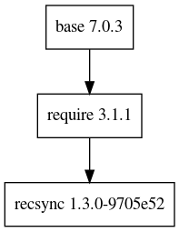

# Deprecation notice

2020-08-20: This remote has been deprecated. Moved to https://gitlab.esss.lu.se/e3/common/e3-recsync.

e3-recsync
===
ESS Site-specific EPICS module : recsync

This is only the RecCaster (Client). The RecCeiver (Server) should be installed.

## Dependency Plot

||
| :---: |
|**Figure 1** Depdendency Tree. |
